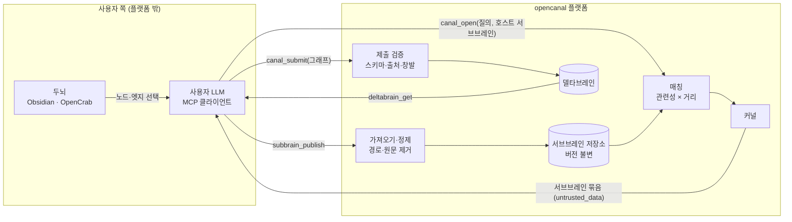

# DATA MAP — 예비 (v0)

> NDSH 6장 정식 지도 전의 예비판. 사용자 → 입력 → 결과와 외부 연결만 표시한다.

## 데이터 항목

| 데이터 | 출처 | 플랫폼 보관 | 누가 보는가 | 공개·비공개 전환 |
|---|---|---|---|---|
| 두뇌 원본 | 사용자 | **보관 안 함** | 사용자만 | 해당 없음 |
| 서브브레인 버전 (노드 라벨, 유형, 짧은 요약, 엣지, 태그) | 사용자 선택 | 모든 버전을 ID로 보관 (D-005) | 주인. 공개 상태면 검색 사용자와 커널 참여자 | 비공개로 바꾸면 검색·새 커널·`canal_get`에서 빠진다. 기존 델타브레인의 파생 노드는 유지하고 주인 표시는 암호화한다 (D-006) |
| 원문 텍스트, `source_url`, 로컬 경로 | 두뇌 | **가져올 때 제거** | — | — |
| 질의 문장 | 호스트 | 보관 | 호스트와 참여자 전원 | 커널과 함께 |
| 델타브레인 + 출처 | 합성기 | ID로 보관 (D-005) | 그 커널 참여자 전원 | 공개·비공개 상태가 없다. 항상 참여자 전용 |
| 계정, 티어, MCP 토큰 **해시** | 플랫폼 | 보관 | 본인과 운영자 | 영구 삭제 경로는 R1 전에 정함 (D-005, TASK-002) |
| 백업 | 플랫폼 | Fernet 암호화, 분리 보관 | 운영자만 (복구 경로) | 보관 기간 미정 (D-005) |

## 신뢰 경계

1. **사용자 LLM → 플랫폼:** 모든 도구 인자는 스키마로 검증한다. 사용자와 tenant는 인자에서 받지 않고 **토큰에서 유도**한다.
2. **플랫폼 → 사용자 LLM:** 남의 서브브레인 내용은 불신 데이터다. 항상 `untrusted_data` 봉투에 넣어 반환한다.
3. **외부 연결 (v0):** 없음. Q1은 질의자 LLM 합성으로 확정했다. 나중에 플랫폼측 합성(B·C)을 넣으면 LLM 공급자가 추가되므로 이 지도를 다시 쓴다.
