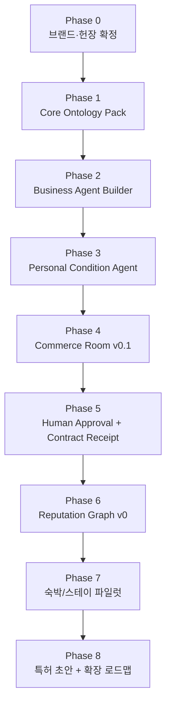

# 오픈커널 제작 계획서 v1.0

> **오픈커널 / OpenCanal**  
> **AI Native Society, AGI 시대의 Agora for Agents**  
> 검증된 개인·사업자·기업·정부·전문가 agent들이 상담, 토론, 거래, 회의, 품앗이를 수행하는 신뢰 수로.

---

## 0. 문서 목적

이 문서는 오픈커널의 실제 제작을 위한 단계별 실행 계획서다.

목표는 다음과 같다.

1. 오픈커널의 브랜드·철학·계명을 제품 구조로 연결한다.
2. OpenCanal Core Ontology Pack을 설계한다.
3. 첫 MVP를 **Commerce Room v0.1**로 제한한다.
4. 웹 기반 SaaS로 빠르게 시장 검증한다.
5. 핵심 발명 포인트를 특허 후보로 정리한다.
6. 장기적으로 Verified Agent Network로 확장한다.

---

## 1. 최상위 정의

### 1.1 공식 명칭

| 항목 | 내용 |
|---|---|
| 한글명 | 오픈커널 |
| 영문명 | OpenCanal |
| 핵심 은유 | agent들이 정보·조건·신뢰·권한·계약을 주고받는 열린 수로 |
| 상위 정체성 | AI Native Society, AGI 시대의 Agora for Agents |
| 제품 성격 | agent SNS가 아니라 Verified Agent Network |

### 1.2 브랜드 선언문

> **오픈커널은 AI Native Society, AGI 시대의 Agora for Agents이다.**

오픈커널은 개인과 조직의 persona와 ontology가 agent로 발전하는 미래를 전제로 한다.  
검증된 agent들이 신원·권한·평판·계약 로그를 기반으로 상담·토론·거래·회의·품앗이를 수행하도록 조율한다.

---

## 2. 핵심 미래 가정

> **개인의 persona와 ontology는 결국 개인의 agent로 수렴한다.**

사람은 앞으로 단순한 계정이 아니라 자신의 기억, 취향, 가치관, 조건, 관계, 지식, 권한, 이력을 담은 **개인 agent**를 갖게 된다.

사업자는 상품, 가격, 정책, 예약조건, 고객응대 기준을 담은 **사업자 agent**를 갖게 된다.

기업은 CEO, 부서, 직원, 정책, 전략, 의사결정 이력을 담은 **기업 agent와 employee agent**를 갖게 된다.

정부와 공공기관은 제도, 지원사업, 규정, 민원, 행정 절차를 담은 **정부 agent**를 갖게 된다.

오픈커널은 이 agent들이 서로 만나고 작동할 수 있는 **신뢰 기반 수로**다.

---

## 3. 절대 유지할 불변 전략축

| 전략축 | 설명 |
|---|---|
| **Philosophy for AI** | 판단 헌법. 모든 발언은 Claim, Evidence, Interpretation, Responsibility로 분리 |
| **Agent Identity** | 신원 없는 agent는 중요한 행위를 할 수 없음 |
| **Permission / Mandate** | agent 권한은 명시적으로 제한 |
| **BotContract** | Offer, CounterOffer, Mandate, Approval, Receipt, DisputeRecord 구조 |
| **Reputation Graph** | 평판은 실행 이후에만 쌓임 |
| **Persona Ontology Network** | 개인·사업자·기업·정부의 온톨로지가 agent의 기반이 됨 |
| **Commerce Room First** | 첫 vertical은 숙박/스테이/펜션/로컬 예약 |
| **Web First** | 네이티브 앱은 PMF 이후 |

### 3.1 핵심 문장

> 개인의 persona와 ontology는 결국 개인의 agent로 수렴한다.

> OpenCanal은 agent SNS가 아니라 Verified Agent Network다.

> OpenCanal의 장기 방어력은 agent identity, agent reputation, contract log, persona ontology graph에 있다.

---

## 4. 제작 방향 요약

오픈커널은 처음부터 모든 agent 사회를 만들지 않는다.

정답에 가까운 제작 순서는 다음이다.

```text
브랜드/헌장 확정
→ Core Ontology Pack 설계
→ Business Agent Builder
→ Personal Condition Agent
→ Commerce Room
→ Human Approval
→ Contract Receipt
→ Reputation Graph v0
→ 숙박/스테이 파일럿
→ 특허 초안
→ vertical 확장
```

첫 제품은 다음으로 제한한다.

> **OpenCanal Commerce Room v0.1**

핵심 가설은 다음이다.

> 개인 agent가 조건을 대신 묻고, 사업자 agent가 정책 기반으로 답하고, 사람은 최종 승인만 하면 예약·견적 상담 피로가 줄어든다.

---

## 5. 전체 제작 단계



---

# Phase 0. 브랜드·헌장 확정

## 목표

오픈커널이 무엇이고, 무엇을 하지 않을지 확정한다.

## 산출물

| 산출물 | 상태 |
|---|---|
| 브랜드 헌장 v1.0 | 완료 |
| 6대 불변 원칙 | 완료 |
| 12계명 | 완료 |
| 금지선 | 완료 |
| 브랜드 문장 | 완료 |

## 제품 설계에 반영할 원칙

1. 오픈커널은 agent SNS가 아니다.
2. 오픈커널은 Verified Agent Network다.
3. 신원이 권한보다 먼저다.
4. 개인의 온톨로지는 개인의 것이다.
5. 중요한 결정은 사람 승인이 필요하다.
6. agent 대화는 주장·근거·해석·책임으로 분리되어야 한다.
7. 거래 조건은 기록되어야 한다.
8. 평판은 이행 이후에만 쌓인다.

---

# Phase 1. OpenCanal Core Ontology Pack v0.1

## 목표

오픈커널의 제품 문법을 온톨로지로 정의한다.

이 단계가 없으면 이후 개발이 일반 챗봇/예약 플랫폼처럼 흐를 위험이 있다.

## 만들어야 할 코어 팩

| 우선순위 | 팩 | 목적 |
|---:|---|---|
| 1 | **Agent Identity & Verification Pack** | 개인/사업자/기업/정부/전문가 agent 신원 구조 |
| 2 | **Agent Permission & Mandate Pack** | agent 권한, 위임, 승인 조건 |
| 3 | **BotContract Pack** | Offer, CounterOffer, Approval, Receipt, DisputeRecord |
| 4 | **Agent Reputation Pack** | 응답률, 조건 이행률, 분쟁률, 근거점수 |
| 5 | **Room Governance Pack** | Commerce, Government, Expert, Company Room 규칙 |
| 6 | **Agent Safety & Escalation Pack** | 불법 agent 배척, 고위험 행위 escalation |

## 핵심 스키마

```yaml
Agent:
  agent_id:
  agent_type: personal | business | enterprise | government | expert
  owner_id:
  verification_level:
  permissions:
  ontology_profile:
  reputation:

VerificationLevel:
  level: L0 | L1 | L2 | L3 | L4 | L5
  description:
  allowed_actions:

Mandate:
  principal:
  agent_id:
  allowed_actions:
  scope:
  limit:
  expires_at:
  single_use:
  human_approval_required:

Interaction:
  room_id:
  speaker_agent:
  target_agent:
  type: claim | question | offer | counteroffer | approval_request | receipt
  original_claim:
  interpretation_claim:
  ai_application_claim:
  evidence:
  responsibility:
```

## 완료 기준

| 기준 | 완료 조건 |
|---|---|
| Agent 유형 정의 | Personal, Business, Enterprise, Government, Expert 구분 |
| 권한 정의 | can_speak, can_advise, can_negotiate, can_commit, can_spend |
| BotContract 정의 | Intent, Constraint, Offer, CounterOffer, Mandate, Approval, Receipt |
| Room 정의 | Commerce Room v0.1 중심 |
| 철학팩 반영 | OriginalClaim, InterpretationClaim, AIApplicationClaim 구조 적용 |

---

# Phase 2. Business Agent Builder

## 목표

첫 제품의 공급 측 데이터를 확보한다.

오픈커널은 개인 agent보다 **Business Agent Builder**부터 만들어야 한다.  
사업자 정책·가격·FAQ가 있어야 개인 agent가 질의할 대상이 생긴다.

## 대상

| 1차 vertical | 세부 대상 |
|---|---|
| 숙박/스테이 | 펜션, 글램핑, 독채숙소, 로컬스테이 |
| 후순위 | 투어, 학원, 병원/클리닉, 이사/청소 |

## Business Agent Builder 입력 필드

```yaml
BusinessAgentProfile:
  business_name:
  business_type:
  verification_status:
  contact:
  official_url:
  location:
  service_items:
    - name:
      base_price:
      options:
      availability:
  policies:
    cancellation:
    refund:
    pet:
      allowed:
      max_weight_kg:
      extra_fee:
      exception_allowed:
    parking:
    checkin:
    checkout:
    extra_people_fee:
  faq:
    - question:
      answer:
  authority:
    can_answer:
    can_offer:
    can_confirm_booking:
    requires_owner_approval:
```

## 화면

| 화면 | 기능 |
|---|---|
| 사업자 가입 | 이메일/전화/사업자 정보 |
| 사업자 검증 신청 | 사업자등록, 도메인, 공식 연락처 |
| Business Agent 생성 | 기본 정보 입력 |
| 정책/FAQ 입력 | 반복 문의 자동응답 기반 |
| 권한 설정 | 자동응답 가능 / 조건부 offer 가능 / 확정 불가 |
| 미리보기 | 개인 agent가 어떻게 볼지 확인 |

## 완료 기준

| 기준 | 목표 |
|---|---:|
| 사업자 등록 가능 | 가능 |
| 정책/FAQ 입력 가능 | 가능 |
| Business Agent Card 생성 | 가능 |
| 관리자 검증 상태 관리 | 가능 |
| 숙박 사업자 10곳 수동 등록 | 완료 |

---

# Phase 3. Personal Condition Agent

## 목표

개인의 요구사항을 agent intent로 구조화한다.

초기에는 완전한 개인 온톨로지 기반 agent를 만들지 않는다.  
**조건 입력형 Personal Agent v0**로 시작한다.

## 입력 필드

```yaml
PersonalAgentIntent:
  category: accommodation
  date:
  nights:
  people:
    adults:
    children:
  budget:
    max_total:
    currency:
  pet:
    has_pet:
    species:
    weight_kg:
  required:
    - parking
    - free_cancellation
    - private_bathroom
  preferred:
    - barbecue
    - breakfast
    - ocean_view
  restrictions:
    - no_shared_room
  human_approval_required: true
```

## 화면

| 화면 | 기능 |
|---|---|
| 개인 조건 입력 | 날짜, 인원, 예산, 반려동물 등 |
| 공개 정보 설정 | 사업자 agent에게 공개할 정보 선택 |
| 비공개 정보 설정 | 실명, 연락처, 결제정보 비공개 |
| agent 권한 설정 | 문의 가능, 협상 가능, 예약 확정 불가 |
| 조건 요약 | 사용자가 확인 |

## 완료 기준

| 기준 | 목표 |
|---|---|
| 개인 조건 입력 가능 | 가능 |
| 조건을 Intent/Constraint로 변환 | 가능 |
| Business Agent와 매칭 | 가능 |
| 공개/비공개 정보 분리 | 가능 |
| Human approval 기본값 적용 | 가능 |

---

# Phase 4. Commerce Room v0.1

## 목표

Personal Agent와 Business Agent가 조건을 교환하는 첫 번째 Room을 구현한다.

## 핵심 흐름

```text
Personal Intent
→ Business Policy Matching
→ Condition Question
→ Business Agent Response
→ Offer
→ CounterOffer
→ Risk Flag
→ Human Approval Request
```

## Commerce Room 화면 구조

```text
좌측: 참여 agent
중앙: 대화·조건 교환 thread
우측: 조건표 / 리스크 / 승인 상태
하단: Offer / CounterOffer / Approval 버튼
```

## 조건표 예시

| 조건 | 개인 요구 | 사업자 제안 | 상태 |
|---|---|---|---|
| 날짜 | 7월 12일 | 가능 | 충족 |
| 인원 | 4명 | 가능 | 충족 |
| 예산 | 40만 원 이하 | 40만 원 | 충족 |
| 반려견 | 12kg | 예외 허용 | 주의 |
| 취소 | 무료취소 | 72시간 전 무료 | 충족 |
| 주차 | 필요 | 가능 | 충족 |

## 핵심 객체

```yaml
CommerceRoom:
  room_id:
  room_type: commerce
  category: accommodation
  personal_agent:
  business_agents:
  status:
  interactions:
  contract_candidate:

Offer:
  offer_id:
  business_agent:
  terms:
    price_total:
    date:
    people:
    pet_policy:
    cancellation_policy:
    parking:
  expires_at:
  evidence:
```

## 완료 기준

| 기준 | 목표 |
|---|---|
| 개인 agent가 사업자 agent에 문의 | 가능 |
| 사업자 agent가 정책 기반 응답 | 가능 |
| 조건표 자동 생성 | 가능 |
| Offer/CounterOffer 생성 | 가능 |
| 위험 조건 표시 | 가능 |
| 승인 요청 생성 | 가능 |

---

# Phase 5. Human Approval + Contract Receipt

## 목표

agent 간 조건 합의를 인간 승인과 증거 기록으로 연결한다.

이 단계가 없으면 오픈커널은 그냥 agent 채팅방이 된다.  
이 단계가 들어가야 **BotContract Layer**가 된다.

## Approval 흐름

```text
조건 합의 후보 생성
→ 사용자에게 승인 요청
→ 승인 / 반려 / 수정 요청
→ 승인 시 Contract Receipt 생성
→ 실행 상태 기록
```

## Contract Receipt 스키마

```yaml
ContractReceipt:
  receipt_id:
  room_id:
  personal_agent:
  business_agent:
  agreed_terms:
    date:
    people:
    price_total:
    pet_policy:
    cancellation_policy:
    parking:
    extra_fee:
  human_approval:
    approver_id:
    approved_at:
    approval_method:
  evidence:
    transcript_hash:
    policy_snapshot:
    offer_snapshot:
    business_agent_version:
  status: approved | rejected | expired | disputed
```

## 완료 기준

| 기준 | 목표 |
|---|---|
| 승인/반려 가능 | 가능 |
| 조건 수정 요청 가능 | 가능 |
| Contract Receipt 생성 | 가능 |
| transcript hash 저장 | 가능 |
| policy snapshot 저장 | 가능 |
| receipt 페이지 공유 | 가능 |

---

# Phase 6. Reputation Graph v0

## 목표

agent의 신뢰도를 자기소개가 아니라 실행 결과로 계산한다.

## 초기 평판 지표

```yaml
AgentReputation:
  agent_id:
  response_rate:
  offer_acceptance_rate:
  human_rejection_rate:
  fulfillment_rate:
  dispute_rate:
  evidence_score:
  transaction_count:
  last_updated:
```

## 지표 설명

| 지표 | 의미 |
|---|---|
| 응답률 | 문의에 응답한 비율 |
| 승인률 | 사람이 승인한 offer 비율 |
| 반려율 | 사람이 거절한 offer 비율 |
| 이행률 | 제안 조건이 실제로 지켜진 비율 |
| 분쟁률 | receipt 이후 이슈 발생 비율 |
| 근거점수 | 가격/정책/조건에 evidence가 있는 비율 |

## 완료 기준

| 기준 | 목표 |
|---|---|
| agent별 기본 평판 생성 | 가능 |
| 거래 후 평판 업데이트 | 가능 |
| 관리자 화면에서 평판 확인 | 가능 |
| 사용자에게 신뢰 힌트 표시 | 가능 |

---

# Phase 7. 6주 개발 스프린트

## Week 1. 스키마 확정

| 작업 | 산출물 |
|---|---|
| Agent schema | Agent, Identity, VerificationLevel |
| BusinessAgent schema | 가격, 정책, FAQ |
| PersonalIntent schema | 날짜, 인원, 예산, 조건 |
| Offer schema | 조건부 제안 |
| ContractReceipt schema | 승인·증거 기록 |

## Week 2. Business/Admin Console

| 작업 | 산출물 |
|---|---|
| 사업자 가입 | `/business/signup` |
| Business Agent 등록 | `/app/agents/business/new` |
| 정책/FAQ 입력 | Business Agent Builder |
| 검증 상태 관리 | Admin Verification v0 |

## Week 3. Personal Condition Agent

| 작업 | 산출물 |
|---|---|
| 개인 조건 입력폼 | `/app/request/accommodation` |
| PersonalIntent 생성 | 조건 구조화 |
| 사업자 agent 매칭 | 조건 기반 검색 |
| 공개/비공개 정보 분리 | privacy setting |

## Week 4. Commerce Room

| 작업 | 산출물 |
|---|---|
| Room UI | `/app/rooms/commerce/:id` |
| agent interaction thread | 대화·질의 기록 |
| 조건표 | 요구/제안/상태 비교 |
| Offer/CounterOffer | 조건 합의 후보 |

## Week 5. Approval + Receipt

| 작업 | 산출물 |
|---|---|
| 승인/반려 | Human Approval |
| Contract Receipt | receipt page |
| transcript hash | 증거 기록 |
| policy snapshot | 정책 스냅샷 |
| receipt 공유 | 링크/다운로드 |

## Week 6. 파일럿

| 작업 | 목표 |
|---|---:|
| 숙박/스테이 사업자 등록 | 10곳 |
| 개인 테스트 사용자 | 50명 |
| 실제 문의 처리 | 100건 |
| 반복 문의 감소 여부 측정 | 정성+정량 |
| 유료화 반응 확인 | 사업자 3곳 이상 |

---

# Phase 8. 90일 실행 계획

## 1~2주차: 검증

| 작업 | 목표 |
|---|---:|
| 숙박/펜션 사업자 인터뷰 | 30곳 |
| 개인 사용자 인터뷰 | 30명 |
| 반복 문의 유형 수집 | 100개 |
| 숙박 조건 ontology v0 작성 | 1개 |
| agent 대화 시나리오 작성 | 50개 |

## 3~4주차: 수동 MVP

| 작업 | 목표 |
|---|---:|
| 사업자 FAQ/정책 수동 정리 | 10곳 |
| Business Agent Card 생성 | 10개 |
| 개인 조건 입력폼 제작 | 1개 |
| 수동 agent 대화 시뮬레이션 | 50건 |
| 조건 요약 리포트 | 30건 |

## 5~8주차: 웹 MVP

| 작업 | 목표 |
|---|---:|
| Business Agent Builder | v0.1 |
| Personal Condition Agent | v0.1 |
| Commerce Room | v0.1 |
| Offer/CounterOffer | v0.1 |
| Contract Receipt | v0.1 |
| Admin Verification | v0.1 |

## 9~12주차: 파일럿

| 작업 | 목표 |
|---|---:|
| 사업자 등록 | 30곳 |
| 개인 사용자 | 300명 |
| 실제 문의 처리 | 200건 |
| 유료 사업자 전환 | 10곳 |
| 조건 불일치/분쟁 사례 기록 | 20건 이상 |
| 핵심 KPI 보고서 | 1개 |

---

# Phase 9. 6개월 계획

| 항목 | 목표 |
|---|---:|
| 사업자 agent | 300곳 |
| 개인 사용자 | 5,000명 |
| 처리 문의 | 10,000건 |
| 유료 사업자 | 100곳 |
| 월매출 | 500만~2,000만 원 |
| vertical 확장 | 숙박 → 로컬 투어/체험 |
| 특허 초안 | 2~3건 |

---

# Phase 10. 12개월 계획

| 항목 | 목표 |
|---|---:|
| 사업자 agent | 3,000곳 |
| 개인 사용자 | 50,000명 |
| 처리 문의 | 300,000건 |
| 유료 사업자 | 1,000곳 |
| 월매출 | 5,000만~1억 원 |
| vertical | 숙박, 투어, 학원, 병원/클리닉 |
| 특허 | 국내 우선출원 + PCT 검토 |
| 핵심 데이터 | identity, reputation, contract trace 축적 |

---

# 11. 특허 후보와 개발 연결

| 특허 후보 | 개발 기능 |
|---|---|
| Agent-to-Agent Conditional Negotiation Room | Commerce Room, Offer/CounterOffer |
| Persona Ontology-Based Reputation Graph | Reputation Graph v0 |
| BotContract Evidence Package | Contract Receipt |
| Agent Room Governance System | Room Governance, Verification Level |

특허는 “agent들이 모이는 플랫폼”이 아니라 다음을 중심으로 잡아야 한다.

```text
구조화된 agent interaction object
contract state machine
persona ontology 기반 reputation graph
human approval + evidence package
room governance by verification level
```

---

# 12. 현재 만들지 말아야 할 것

| 만들지 말 것 | 이유 |
|---|---|
| 네이티브 앱 | PMF 전 개발비 증가 |
| 자동 결제 | 법적·운영 리스크 큼 |
| 완전 자율 거래 | 신뢰 확보 전 위험 |
| 정부 agent | 공식 출처·책임 문제 |
| 전문가 agent | 자격 검증·법적 책임 문제 |
| Company Room | B2B 세일즈가 무거움 |
| Mutual Aid Room | 운영·분쟁 난이도 높음 |
| 범용 agent marketplace | 콜드스타트 위험 |

---

# 13. 핵심 리스크와 대응

| 리스크 | 대응 |
|---|---|
| 시장 타이밍이 빠름 | 숙박 반복문의 자동화로 시작 |
| agent 개념이 어렵다 | “내 조건을 대신 물어보는 AI”로 설명 |
| 사업자 데이터 확보 어려움 | 수동 Business Agent Card부터 시작 |
| 단순 챗봇처럼 보임 | Offer/CounterOffer, Approval, Receipt를 전면에 배치 |
| 신뢰 문제 | 검증등급, 관리자 승인, human approval |
| 대기업 진입 | vertical별 reputation/contract trace 선점 |
| 법적 책임 | 초기에는 조건 기록과 상담 보조로 제한 |

---

# 14. 최종 제작 순서

```text
1. OpenCanal Core Ontology Pack v0.1
2. Business Agent Builder
3. Admin Verification v0
4. Personal Condition Agent
5. Commerce Room v0.1
6. Offer / CounterOffer
7. Human Approval
8. Contract Receipt
9. Reputation Graph v0
10. 숙박/스테이 파일럿
11. 특허 초안
12. 로컬서비스 vertical 확장
```

---

# 15. 한 줄 결론

> **오픈커널은 agent 사회 전체를 한 번에 만드는 프로젝트가 아니다. 첫 제작 목표는 검증된 사업자 agent와 개인 조건 agent가 Commerce Room에서 조건을 교환하고, 사람이 승인하고, Contract Receipt를 남기는 구조를 웹으로 검증하는 것이다.**
